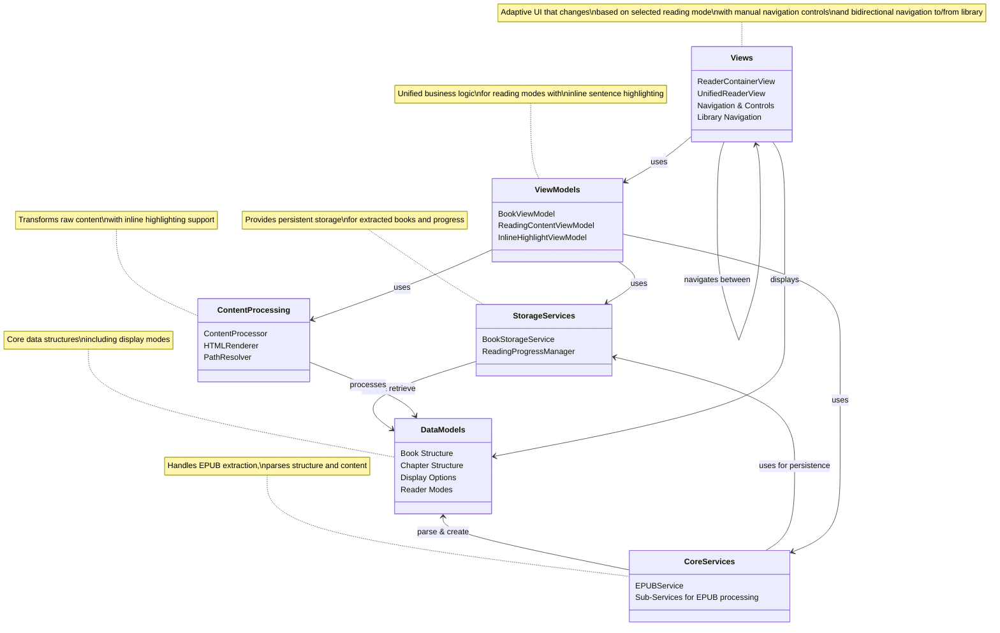

```mermaid
classDiagram
    %% High-level Architecture Overview
    class CoreServices {
        EPUBService
        Sub-Services for EPUB processing
    }
    
    class StorageServices {
        BookStorageService
        ReadingProgressManager
    }
    
    class DataModels {
        Book Structure
        Chapter Structure
        Display Options
        Reader Modes
    }
    
    class ContentProcessing {
        ContentProcessor
        HTMLRenderer
        PathResolver
    }
    
    class ViewModels {
        BookViewModel
        ReadingContentViewModel
        InlineHighlightViewModel
    }
    
    class Views {
        ReaderContainerView
        UnifiedReaderView
        Navigation & Controls
        Library Navigation
    }
    
    DataModels <-- CoreServices : parse & create
    StorageServices --> DataModels : store & retrieve
    StorageServices <-- CoreServices : uses for persistence
    ContentProcessing --> DataModels : processes
    ViewModels --> CoreServices : uses
    ViewModels --> StorageServices : uses
    ViewModels --> ContentProcessing : uses
    Views --> ViewModels : uses
    Views --> DataModels : displays
    Views --> Views : navigates between
    
    note for CoreServices "Handles EPUB extraction,\nparses structure and content"
    note for StorageServices "Provides persistent storage\nfor extracted books and progress"
    note for DataModels "Core data structures\nincluding display modes"
    note for ContentProcessing "Transforms raw content\nwith inline highlighting support"
    note for ViewModels "Unified business logic\nfor reading modes with\ninline sentence highlighting"
    note for Views "Adaptive UI that changes\nbased on selected reading mode\nwith manual navigation controls\nand bidirectional navigation to/from library"
``` 