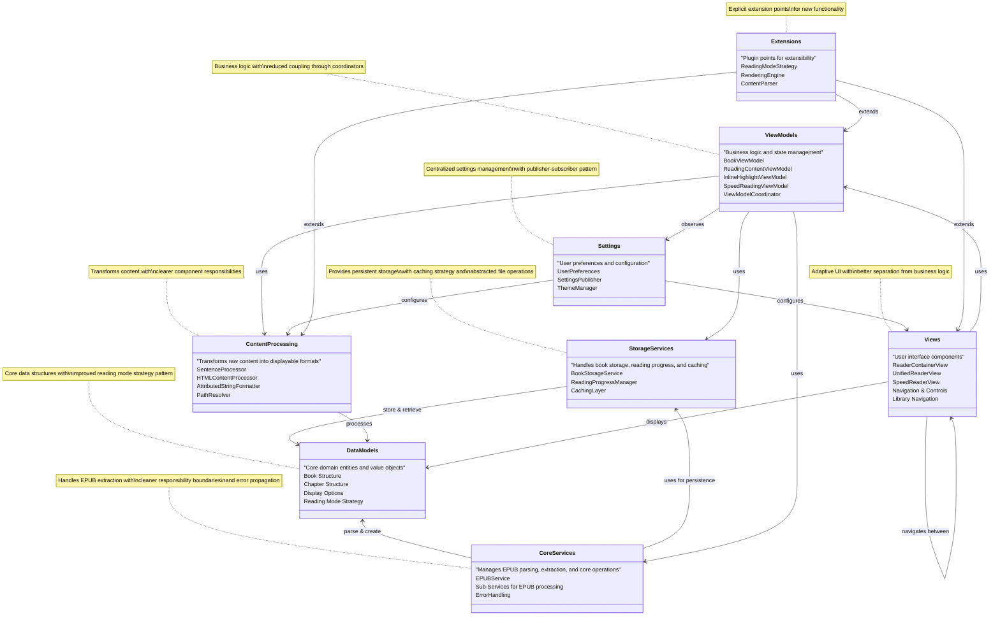

```mermaid
classDiagram
    %% High-level Architecture Overview - Improved Design
    class CoreServices {
        "Manages EPUB parsing, extraction, and core operations"
        EPUBService
        Sub-Services for EPUB processing
        ErrorHandling
    }
    
    class StorageServices {
        "Handles book storage, reading progress, and caching"
        BookStorageService
        ReadingProgressManager
        CachingLayer
    }
    
    class DataModels {
        "Core domain entities and value objects"
        Book Structure
        Chapter Structure
        Display Options
        Reading Mode Strategy
    }
    
    class ContentProcessing {
        "Transforms raw content into displayable formats"
        SentenceProcessor
        HTMLContentProcessor
        AttributedStringFormatter
        PathResolver
    }
    
    class ViewModels {
        "Business logic and state management"
        BookViewModel
        ReadingContentViewModel
        InlineHighlightViewModel
        SpeedReadingViewModel
        ViewModelCoordinator
    }
    
    class Views {
        "User interface components"
        ReaderContainerView
        UnifiedReaderView
        SpeedReaderView
        Navigation & Controls
        Library Navigation
    }
    
    class Settings {
        "User preferences and configuration"
        UserPreferences
        SettingsPublisher
        ThemeManager
    }

    class Extensions {
        "Plugin points for extensibility"
        ReadingModeStrategy
        RenderingEngine
        ContentParser
    }
    
    DataModels <-- CoreServices : parse & create
    StorageServices --> DataModels : store & retrieve
    StorageServices <-- CoreServices : uses for persistence
    ContentProcessing --> DataModels : processes
    ViewModels --> CoreServices : uses
    ViewModels --> StorageServices : uses
    ViewModels --> ContentProcessing : uses
    Views --> ViewModels : uses
    Views --> DataModels : displays
    Views --> Views : navigates between
    Settings --> Views : configures
    Settings --> ContentProcessing : configures
    ViewModels --> Settings : observes
    Extensions --> ContentProcessing : extends
    Extensions --> ViewModels : extends
    Extensions --> Views : extends
    
    note for CoreServices "Handles EPUB extraction with\ncleaner responsibility boundaries\nand error propagation"
    note for StorageServices "Provides persistent storage\nwith caching strategy and\nabstracted file operations"
    note for DataModels "Core data structures with\nimproved reading mode strategy pattern"
    note for ContentProcessing "Transforms content with\nclearer component responsibilities"
    note for ViewModels "Business logic with\nreduced coupling through coordinators"
    note for Views "Adaptive UI with\nbetter separation from business logic"
    note for Settings "Centralized settings management\nwith publisher-subscriber pattern"
    note for Extensions "Explicit extension points\nfor new functionality"
``` 