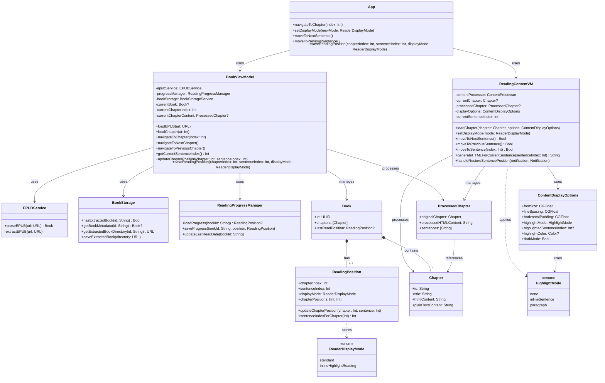

```mermaid
classDiagram
    %% Book Reading Lifecycle Class Diagram
    
    class App {
        +navigateToChapter(index: Int)
        +setDisplayMode(newMode: ReaderDisplayMode)
        +moveToNextSentence()
        +moveToPreviousSentence()
        +saveReadingPosition(chapterIndex: Int, sentenceIndex: Int, displayMode: ReaderDisplayMode)
    }
    
    class BookViewModel {
        -epubService: EPUBService
        -progressManager: ReadingProgressManager
        -bookStorage: BookStorageService
        -currentBook: Book?
        -currentChapterIndex: Int
        -currentChapterContent: ProcessedChapter?
        +loadEPUB(url: URL)
        +loadChapter(at: Int)
        +navigateToChapter(index: Int)
        +navigateToNextChapter()
        +navigateToPreviousChapter()
        +getCurrentSentenceIndex() Int
        +updateChapterPosition(chapter: Int, sentenceIndex: Int)
        +saveReadingPosition(chapterIndex: Int, sentenceIndex: Int, displayMode: ReaderDisplayMode)
    }
    
    class EPUBService {
        +parseEPUB(url: URL) Book
        -extractEPUB(url: URL)
    }
    
    class BookStorage {
        +hasExtractedBook(id: String) Bool
        +getBookMetadata(id: String) Book?
        +getExtractedBookDirectory(id: String) URL
        +saveExtractedBook(directory: URL)
    }
    
    class ReadingContentVM {
        -contentProcessor: ContentProcessor
        -currentChapter: Chapter?
        -processedChapter: ProcessedChapter?
        -displayOptions: ContentDisplayOptions
        -currentSentenceIndex: Int
        +loadChapter(chapter: Chapter, options: ContentDisplayOptions)
        +setDisplayMode(mode: ReaderDisplayMode)
        +moveToNextSentence() Bool
        +moveToPreviousSentence() Bool
        +moveToSentence(index: Int) Bool
        +generateHTMLForCurrentSentence(sentenceIndex: Int) String
        +handleRestoreSentencePosition(notification: Notification)
    }
    
    class ReadingProgressManager {
        +loadProgress(bookId: String) ReadingPosition?
        +saveProgress(bookId: String, position: ReadingPosition)
        +updateLastReadDate(bookId: String)
    }
    
    class Book {
        +id: UUID
        +chapters: [Chapter]
        +lastReadPosition: ReadingPosition?
    }
    
    class ReadingPosition {
        +chapterIndex: Int
        +sentenceIndex: Int
        +displayMode: ReaderDisplayMode
        +chapterPositions: [Int: Int]
        +updateChapterPosition(chapter: Int, sentence: Int)
        +sentenceIndexForChapter(Int) Int
    }
    
    class Chapter {
        +id: String
        +title: String
        +htmlContent: String
        +plainTextContent: String
    }
    
    class ProcessedChapter {
        +originalChapter: Chapter
        +processedHTMLContent: String
        +sentences: [String]
    }
    
    class ContentDisplayOptions {
        +fontSize: CGFloat
        +lineSpacing: CGFloat
        +horizontalPadding: CGFloat
        +highlightMode: HighlightMode
        +highlightedSentenceIndex: Int?
        +highlightColor: Color?
        +darkMode: Bool
    }
    
    class ReaderDisplayMode {
        <<enum>>
        standard
        inlineHighlightReading
    }
    
    class HighlightMode {
        <<enum>>
        none
        inlineSentence
        paragraph
    }
    
    %% Relationships
    App --> BookViewModel : uses
    App --> ReadingContentVM : uses
    BookViewModel --> EPUBService : uses
    BookViewModel --> BookStorage : uses
    BookViewModel --> ReadingProgressManager : uses
    BookViewModel --> Book : manages
    BookViewModel --> ProcessedChapter : processes
    ReadingContentVM --> Chapter : processes
    ReadingContentVM --> ProcessedChapter : manages
    ReadingContentVM --> ContentDisplayOptions : uses
    ReadingContentVM ..> HighlightMode : applies
    Book *-- "*" Chapter : contains
    Book *-- "0..1" ReadingPosition : has
    ReadingPosition ..> ReaderDisplayMode : stores
    ProcessedChapter --> Chapter : references
    ContentDisplayOptions ..> HighlightMode : uses
``` 