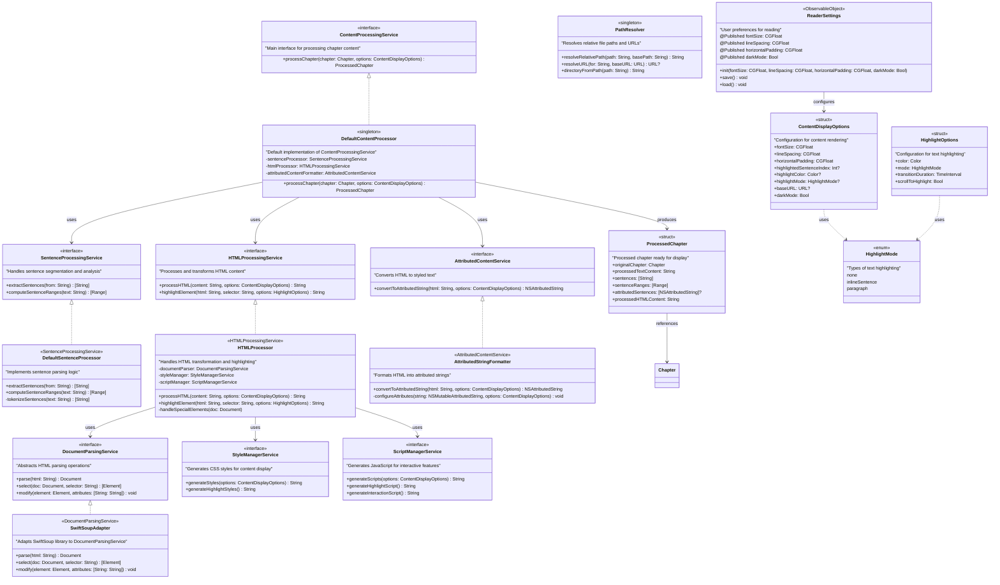

```mermaid
classDiagram
    %% Content Processing Layer - Improved Design
    
    %% Abstract service interfaces
    class ContentProcessingService {
        "Main interface for processing chapter content"
        <<interface>>
        +processChapter(chapter: Chapter, options: ContentDisplayOptions) ProcessedChapter
    }
    
    class SentenceProcessingService {
        "Handles sentence segmentation and analysis"
        <<interface>>
        +extractSentences(from: String) [String]
        +computeSentenceRanges(text: String) [Range<String.Index>]
    }
    
    class HTMLProcessingService {
        "Processes and transforms HTML content"
        <<interface>>
        +processHTML(content: String, options: ContentDisplayOptions) String
        +highlightElement(html: String, selector: String, options: HighlightOptions) String
    }
    
    class AttributedContentService {
        "Converts HTML to styled text"
        <<interface>>
        +convertToAttributedString(html: String, options: ContentDisplayOptions) NSAttributedString
    }
    
    %% Default implementations
    class DefaultContentProcessor {
        "Default implementation of ContentProcessingService"
        <<singleton>>
        -sentenceProcessor: SentenceProcessingService
        -htmlProcessor: HTMLProcessingService
        -attributedContentFormatter: AttributedContentService
        +processChapter(chapter: Chapter, options: ContentDisplayOptions) ProcessedChapter
    }
    
    class DefaultSentenceProcessor {
        "Implements sentence parsing logic"
        <<SentenceProcessingService>>
        +extractSentences(from: String) [String]
        +computeSentenceRanges(text: String) [Range<String.Index>]
        -tokenizeSentences(text: String) [String]
    }
    
    class HTMLProcessor {
        "Handles HTML transformation and highlighting"
        <<HTMLProcessingService>>
        -documentParser: DocumentParsingService
        -styleManager: StyleManagerService
        -scriptManager: ScriptManagerService
        +processHTML(content: String, options: ContentDisplayOptions) String
        +highlightElement(html: String, selector: String, options: HighlightOptions) String
        -handleSpecialElements(doc: Document)
    }
    
    class DocumentParsingService {
        "Abstracts HTML parsing operations"
        <<interface>>
        +parse(html: String) Document
        +select(doc: Document, selector: String) [Element]
        +modify(element: Element, attributes: [String: String]) void
    }
    
    class SwiftSoupAdapter {
        "Adapts SwiftSoup library to DocumentParsingService"
        <<DocumentParsingService>>
        +parse(html: String) Document
        +select(doc: Document, selector: String) [Element]
        +modify(element: Element, attributes: [String: String]) void
    }
    
    class StyleManagerService {
        "Generates CSS styles for content display"
        <<interface>>
        +generateStyles(options: ContentDisplayOptions) String
        +generateHighlightStyles() String
    }
    
    class ScriptManagerService {
        "Generates JavaScript for interactive features"
        <<interface>>
        +generateScripts(options: ContentDisplayOptions) String
        +generateHighlightScript() String
        +generateInteractionScript() String
    }
    
    class AttributedStringFormatter {
        "Formats HTML into attributed strings"
        <<AttributedContentService>>
        +convertToAttributedString(html: String, options: ContentDisplayOptions) NSAttributedString
        -configureAttributes(string: NSMutableAttributedString, options: ContentDisplayOptions) void
    }
    
    class PathResolver {
        "Resolves relative file paths and URLs"
        <<singleton>>
        +resolveRelativePath(path: String, basePath: String) String
        +resolveURL(for: String, baseURL: URL) URL?
        +directoryFromPath(path: String) String
    }
    
    class ContentDisplayOptions {
        "Configuration for content rendering"
        <<struct>>
        +fontSize: CGFloat
        +lineSpacing: CGFloat
        +horizontalPadding: CGFloat
        +highlightedSentenceIndex: Int?
        +highlightColor: Color?
        +highlightMode: HighlightMode?
        +baseURL: URL?
        +darkMode: Bool
    }
    
    class HighlightOptions {
        "Configuration for text highlighting"
        <<struct>>
        +color: Color
        +mode: HighlightMode
        +transitionDuration: TimeInterval
        +scrollToHighlight: Bool
    }
    
    class ProcessedChapter {
        "Processed chapter ready for display"
        <<struct>>
        +originalChapter: Chapter
        +processedTextContent: String
        +sentences: [String]
        +sentenceRanges: [Range<String.Index>]
        +attributedSentences: [NSAttributedString]?
        +processedHTMLContent: String
    }

    class ReaderSettings {
        "User preferences for reading"
        <<ObservableObject>>
        @Published fontSize: CGFloat
        @Published lineSpacing: CGFloat
        @Published horizontalPadding: CGFloat
        @Published darkMode: Bool
        +init(fontSize: CGFloat, lineSpacing: CGFloat, horizontalPadding: CGFloat, darkMode: Bool)
        +save() void
        +load() void
    }

    class HighlightMode {
        "Types of text highlighting"
        <<enum>>
        none
        inlineSentence
        paragraph
    }

    %% Relationships
    ContentProcessingService <|.. DefaultContentProcessor
    SentenceProcessingService <|.. DefaultSentenceProcessor
    HTMLProcessingService <|.. HTMLProcessor
    AttributedContentService <|.. AttributedStringFormatter
    DocumentParsingService <|.. SwiftSoupAdapter
    
    DefaultContentProcessor --> SentenceProcessingService : uses
    DefaultContentProcessor --> HTMLProcessingService : uses
    DefaultContentProcessor --> AttributedContentService : uses
    DefaultContentProcessor --> ProcessedChapter : produces
    
    HTMLProcessor --> DocumentParsingService : uses
    HTMLProcessor --> StyleManagerService : uses
    HTMLProcessor --> ScriptManagerService : uses
    
    ContentDisplayOptions ..> HighlightMode : uses
    HighlightOptions ..> HighlightMode : uses
    ReaderSettings --> ContentDisplayOptions : configures
    ProcessedChapter --> Chapter : references
``` 