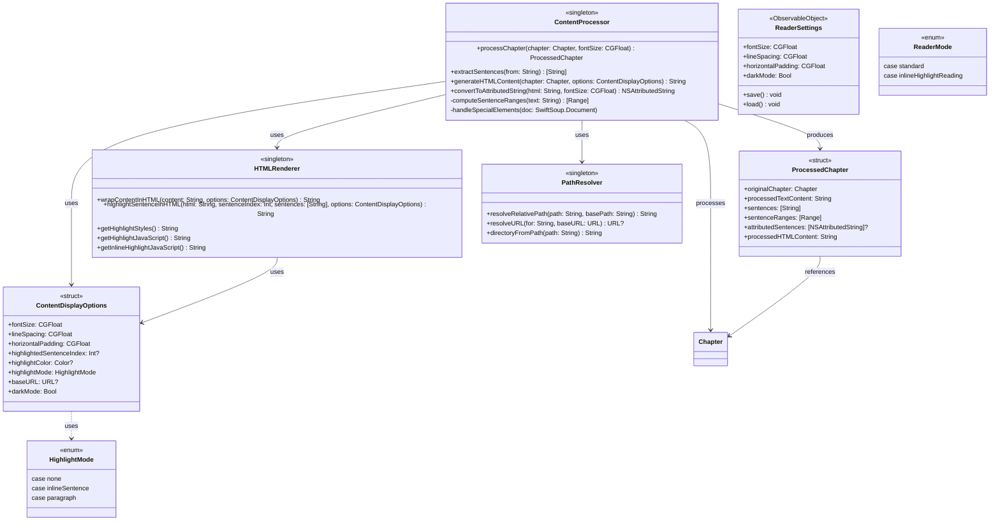

```mermaid
classDiagram
    %% Content Processing Layer
    class ContentProcessor {
        <<singleton>>
        +processChapter(chapter: Chapter, fontSize: CGFloat) ProcessedChapter
        +extractSentences(from: String) [String]
        +generateHTMLContent(chapter: Chapter, options: ContentDisplayOptions) String
        +convertToAttributedString(html: String, fontSize: CGFloat) NSAttributedString
        -computeSentenceRanges(text: String) [Range<String.Index>]
        -handleSpecialElements(doc: SwiftSoup.Document)
    }

    class ContentDisplayOptions {
        <<struct>>
        +fontSize: CGFloat
        +lineSpacing: CGFloat
        +horizontalPadding: CGFloat
        +highlightedSentenceIndex: Int?
        +highlightColor: Color?
        +highlightMode: HighlightMode
        +baseURL: URL?
        +darkMode: Bool
    }

    class ProcessedChapter {
        <<struct>>
        +originalChapter: Chapter
        +processedTextContent: String
        +sentences: [String]
        +sentenceRanges: [Range<String.Index>]
        +attributedSentences: [NSAttributedString]?
        +processedHTMLContent: String
    }

    class HTMLRenderer {
        <<singleton>>
        +wrapContentInHTML(content: String, options: ContentDisplayOptions) String
        +highlightSentenceInHTML(html: String, sentenceIndex: Int, sentences: [String], options: ContentDisplayOptions) String
        +getHighlightStyles() String
        +getHighlightJavaScript() String
        +getInlineHighlightJavaScript() String
    }

    class PathResolver {
        <<singleton>>
        +resolveRelativePath(path: String, basePath: String) String
        +resolveURL(for: String, baseURL: URL) URL?
        +directoryFromPath(path: String) String
    }

    class ReaderSettings {
        <<ObservableObject>>
        +fontSize: CGFloat
        +lineSpacing: CGFloat
        +horizontalPadding: CGFloat
        +darkMode: Bool
        +save() void
        +load() void
    }

    class HighlightMode {
        <<enum>>
        case none
        case inlineSentence
        case paragraph
    }

    class ReaderMode {
        <<enum>>
        case standard
        case inlineHighlightReading
    }

    ContentProcessor --> ProcessedChapter : produces
    ContentProcessor --> ContentDisplayOptions : uses
    ContentProcessor --> HTMLRenderer : uses
    ContentProcessor --> PathResolver : uses
    ContentProcessor --> Chapter : processes
    HTMLRenderer --> ContentDisplayOptions : uses
    ProcessedChapter --> Chapter : references
    ContentDisplayOptions ..> HighlightMode : uses
``` 