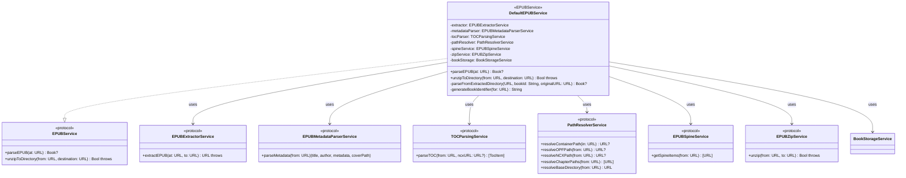

```mermaid
classDiagram
    %% Core Services Layer
    class EPUBService {
        <<protocol>>
        +parseEPUB(at: URL) Book?
        +unzipToDirectory(from: URL, destination: URL) Bool throws
    }

    class DefaultEPUBService {
        <<EPUBService>>
        -extractor: EPUBExtractorService
        -metadataParser: EPUBMetadataParserService
        -tocParser: TOCParsingService
        -pathResolver: PathResolverService
        -spineService: EPUBSpineService
        -zipService: EPUBZipService
        -bookStorage: BookStorageService
        +parseEPUB(at: URL) Book?
        +unzipToDirectory(from: URL, destination: URL) Bool throws
        -parseFromExtractedDirectory(URL, bookId: String, originalURL: URL) Book?
        -generateBookIdentifier(for: URL) String
    }

    %% Sub-services with consistent interfaces
    class EPUBExtractorService {
        <<protocol>>
        +extractEPUB(at: URL, to: URL) URL throws
    }
    
    class EPUBMetadataParserService {
        <<protocol>>
        +parseMetadata(from: URL) (title, author, metadata, coverPath)
    }
    
    class TOCParsingService {
        <<protocol>>
        +parseTOC(from: URL, ncxURL: URL?) [TocItem]
    }
    
    class PathResolverService {
        <<protocol>>
        +resolveContainerPath(in: URL) URL?
        +resolveOPFPath(from: URL) URL?
        +resolveNCXPath(from: URL) URL?
        +resolveChapterPaths(from: URL) [URL]
        +resolveBaseDirectory(from: URL) URL
    }
    
    class EPUBSpineService {
        <<protocol>>
        +getSpineItems(from: URL) [URL]
    }
    
    class EPUBZipService {
        <<protocol>>
        +unzip(from: URL, to: URL) Bool throws
    }

    DefaultEPUBService ..|> EPUBService
    DefaultEPUBService --> EPUBExtractorService : uses
    DefaultEPUBService --> EPUBMetadataParserService : uses
    DefaultEPUBService --> TOCParsingService : uses
    DefaultEPUBService --> PathResolverService : uses
    DefaultEPUBService --> EPUBSpineService : uses
    DefaultEPUBService --> EPUBZipService : uses
    DefaultEPUBService --> BookStorageService : uses
``` 