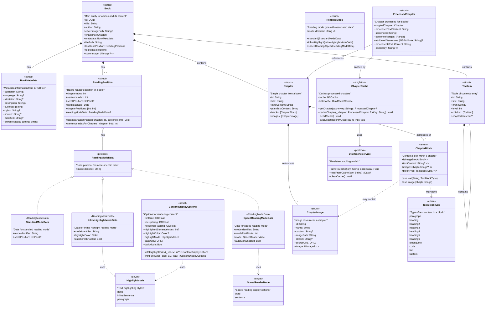

```mermaid
classDiagram
    %% Core Data Models Layer - Improved Design
    class Book {
        "Main entity for a book and its content"
        <<struct>>
        +id: UUID
        +title: String
        +author: String
        +coverImagePath: String?
        +chapters: [Chapter]
        +metadata: BookMetadata
        +filePath: String
        +lastReadPosition: ReadingPosition?
        +tocItems: [TocItem]
        +coverImage: UIImage? <<computed>>
    }

    class BookMetadata {
        "Metadata information from EPUB file"
        <<struct>>
        +publisher: String?
        +language: String?
        +identifier: String?
        +description: String?
        +subjects: [String]
        +rights: String?
        +source: String?
        +modified: String?
        +extraMetadata: [String: String]
    }

    class ReadingPosition {
        "Tracks reader's position in a book"
        <<struct>>
        +chapterIndex: Int
        +sentenceIndex: Int
        +scrollPosition: CGPoint?
        +lastReadDate: Date
        +chapterPositions: [Int: Int]
        +readingModeData: ReadingModeData?
        +updateChapterPosition(chapter: Int, sentence: Int) void
        +sentenceIndexForChapter(_ chapter: Int) Int
    }
    
    class ReadingModeData {
        "Base protocol for mode-specific data"
        <<protocol>>
        +modeIdentifier: String
    }
    
    class StandardModeData {
        "Data for standard reading mode"
        <<ReadingModeData>>
        +modeIdentifier: String
        +scrollPosition: CGPoint?
    }
    
    class InlineHighlightModeData {
        "Data for inline highlight reading mode"
        <<ReadingModeData>>
        +modeIdentifier: String
        +highlightColor: Color
        +autoScrollEnabled: Bool
    }
    
    class SpeedReadingModeData {
        "Data for speed reading mode"
        <<ReadingModeData>>
        +modeIdentifier: String
        +wordsPerMinute: Int
        +mode: SpeedReaderMode
        +autoStartEnabled: Bool
    }
    
    class ReadingMode {
        "Reading mode type with associated data"
        <<enum>>
        +standard(StandardModeData)
        +inlineHighlight(InlineHighlightModeData)
        +speedReading(SpeedReadingModeData)
        +modeIdentifier: String <<computed>>
    }

    class SpeedReaderMode {
        "Speed reading display options"
        <<enum>>
        word
        sentence
    }
    
    class HighlightMode {
        "Text highlighting styles"
        <<enum>>
        none
        inlineSentence
        paragraph
    }

    class ContentDisplayOptions {
        "Options for rendering content"
        <<struct>>
        +fontSize: CGFloat
        +lineSpacing: CGFloat
        +horizontalPadding: CGFloat
        +highlightedSentenceIndex: Int?
        +highlightColor: Color?
        +highlightMode: HighlightMode?
        +baseURL: URL?
        +darkMode: Bool
        +withHighlightIndex(_ index: Int?) ContentDisplayOptions
        +withFontSize(_ size: CGFloat) ContentDisplayOptions
    }

    class Chapter {
        "Single chapter from a book"
        <<struct>>
        +id: String
        +title: String
        +htmlContent: String
        +plainTextContent: String
        +blocks: [ChapterBlock]
        +images: [ChapterImage]
    }

    class ChapterBlock {
        "Content block within a chapter"
        <<enum>>
        case text(String, TextBlockType)
        case image(ChapterImage)
        +isImageBlock: Bool <<computed>>
        +textContent: String? <<computed>>
        +image: ChapterImage? <<computed>>
        +blockType: TextBlockType? <<computed>>
    }

    class ChapterImage {
        "Image resource in a chapter"
        <<struct>>
        +id: String
        +name: String
        +caption: String?
        +imagePath: String
        +altText: String?
        +sourceURL: URL?
        +image: UIImage? <<computed>>
    }

    class TextBlockType {
        "Type of text content in a block"
        <<enum>>
        paragraph
        heading1
        heading2
        heading3
        heading4
        heading5
        heading6
        blockquote
        code
        list
        listItem
    }

    class TocItem {
        "Table of contents entry"
        <<struct>>
        +id: String
        +title: String
        +href: String?
        +level: Int
        +children: [TocItem]
        +chapterIndex: Int?
    }

    class ProcessedChapter {
        "Chapter processed for display"
        <<struct>>
        +originalChapter: Chapter
        +processedTextContent: String
        +sentences: [String]
        +sentenceRanges: [Range<String.Index>]
        +attributedSentences: [NSAttributedString]?
        +processedHTMLContent: String
        +cacheKey: String <<computed>>
    }
    
    class ChapterCache {
        "Caches processed chapters"
        <<singleton>>
        -cache: NSCache<NSString, ProcessedChapter>
        -diskCache: DiskCacheService
        +getChapter(cacheKey: String) ProcessedChapter?
        +cacheChapter(_ chapter: ProcessedChapter, forKey: String) void
        +clearCache() void
        +evictLeastRecentlyUsed(count: Int) void
    }
    
    class DiskCacheService {
        "Persistent caching to disk"
        <<protocol>>
        +saveToCache(key: String, data: Data) void
        +loadFromCache(key: String) Data?
        +clearCache() void
    }

    %% Relationships
    Book *-- "1" BookMetadata : has
    Book *-- "0..1" ReadingPosition : has
    Book *-- "*" Chapter : contains
    Book *-- "*" TocItem : contains
    
    ReadingPosition o-- ReadingModeData : has
    
    ReadingModeData <|.. StandardModeData
    ReadingModeData <|.. InlineHighlightModeData
    ReadingModeData <|.. SpeedReadingModeData
    
    InlineHighlightModeData ..> HighlightMode : uses
    SpeedReadingModeData ..> SpeedReaderMode : uses
    
    Chapter *-- "*" ChapterBlock : composed of
    Chapter *-- "*" ChapterImage : references
    
    ChapterBlock ..> ChapterImage : may contain
    ChapterBlock ..> TextBlockType : may have
    
    TocItem *-- "*" TocItem : contains
    
    ContentDisplayOptions ..> HighlightMode : uses
    
    ProcessedChapter --> Chapter : references
    ProcessedChapter --> ChapterCache : cached by
    
    ChapterCache --> DiskCacheService : uses
``` 