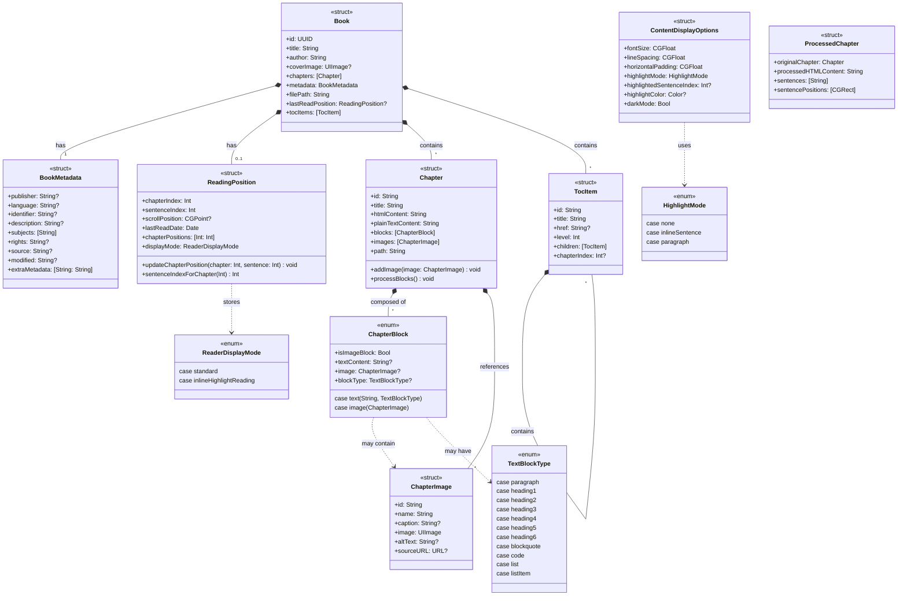

```mermaid
classDiagram
    %% Core Data Models Layer
    class Book {
        <<struct>>
        +id: UUID
        +title: String
        +author: String
        +coverImage: UIImage?
        +chapters: [Chapter]
        +metadata: BookMetadata
        +filePath: String
        +lastReadPosition: ReadingPosition?
        +tocItems: [TocItem]
    }

    class BookMetadata {
        <<struct>>
        +publisher: String?
        +language: String?
        +identifier: String?
        +description: String?
        +subjects: [String]
        +rights: String?
        +source: String?
        +modified: String?
        +extraMetadata: [String: String]
    }

    class ReadingPosition {
        <<struct>>
        +chapterIndex: Int
        +sentenceIndex: Int
        +scrollPosition: CGPoint?
        +lastReadDate: Date
        +chapterPositions: [Int: Int]
        +displayMode: ReaderDisplayMode
        +updateChapterPosition(chapter: Int, sentence: Int) void
        +sentenceIndexForChapter(Int) Int
    }

    class ReaderDisplayMode {
        <<enum>>
        case standard
        case inlineHighlightReading
    }
    
    class HighlightMode {
        <<enum>>
        case none
        case inlineSentence
        case paragraph
    }

    class ContentDisplayOptions {
        <<struct>>
        +fontSize: CGFloat
        +lineSpacing: CGFloat 
        +horizontalPadding: CGFloat
        +highlightMode: HighlightMode
        +highlightedSentenceIndex: Int?
        +highlightColor: Color?
        +darkMode: Bool
    }

    class Chapter {
        <<struct>>
        +id: String
        +title: String
        +htmlContent: String
        +plainTextContent: String
        +blocks: [ChapterBlock]
        +images: [ChapterImage]
        +path: String
        +addImage(image: ChapterImage) void
        +processBlocks() void
    }

    class ChapterBlock {
        <<enum>>
        case text(String, TextBlockType)
        case image(ChapterImage)
        +isImageBlock: Bool
        +textContent: String?
        +image: ChapterImage?
        +blockType: TextBlockType?
    }

    class ChapterImage {
        <<struct>>
        +id: String
        +name: String
        +caption: String?
        +image: UIImage
        +altText: String?
        +sourceURL: URL?
    }

    class TextBlockType {
        <<enum>>
        case paragraph
        case heading1
        case heading2
        case heading3
        case heading4
        case heading5
        case heading6
        case blockquote
        case code
        case list
        case listItem
    }

    class TocItem {
        <<struct>>
        +id: String
        +title: String
        +href: String?
        +level: Int
        +children: [TocItem]
        +chapterIndex: Int?
    }

    class ProcessedChapter {
        <<struct>>
        +originalChapter: Chapter
        +processedHTMLContent: String
        +sentences: [String]
        +sentencePositions: [CGRect]
    }

    Book *-- "1" BookMetadata : has
    Book *-- "0..1" ReadingPosition : has
    Book *-- "*" Chapter : contains
    Book *-- "*" TocItem : contains
    Chapter *-- "*" ChapterBlock : composed of
    Chapter *-- "*" ChapterImage : references
    ChapterBlock ..> ChapterImage : may contain
    ChapterBlock ..> TextBlockType : may have
    TocItem *-- "*" TocItem : contains
    ReadingPosition ..> ReaderDisplayMode : stores
    ContentDisplayOptions ..> HighlightMode : uses
``` 