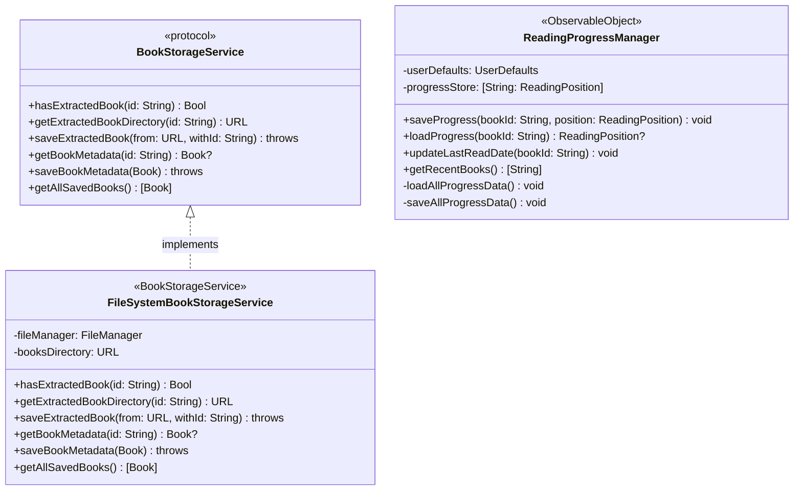

```mermaid
classDiagram
    %% Storage Services Layer
    class BookStorageService {
        <<protocol>>
        +hasExtractedBook(id: String) Bool
        +getExtractedBookDirectory(id: String) URL
        +saveExtractedBook(from: URL, withId: String) throws
        +getBookMetadata(id: String) Book?
        +saveBookMetadata(Book) throws
        +getAllSavedBooks() [Book]
    }

    class FileSystemBookStorageService {
        <<BookStorageService>>
        -fileManager: FileManager
        -booksDirectory: URL
        +hasExtractedBook(id: String) Bool
        +getExtractedBookDirectory(id: String) URL
        +saveExtractedBook(from: URL, withId: String) throws
        +getBookMetadata(id: String) Book?
        +saveBookMetadata(Book) throws
        +getAllSavedBooks() [Book]
    }
    
    class ReadingProgressManager {
        <<ObservableObject>>
        -userDefaults: UserDefaults
        -progressStore: [String: ReadingPosition]
        +saveProgress(bookId: String, position: ReadingPosition) void
        +loadProgress(bookId: String) ReadingPosition?
        +updateLastReadDate(bookId: String) void
        +getRecentBooks() [String]
        -loadAllProgressData() void
        -saveAllProgressData() void
    }

    BookStorageService <|.. FileSystemBookStorageService : implements
``` 