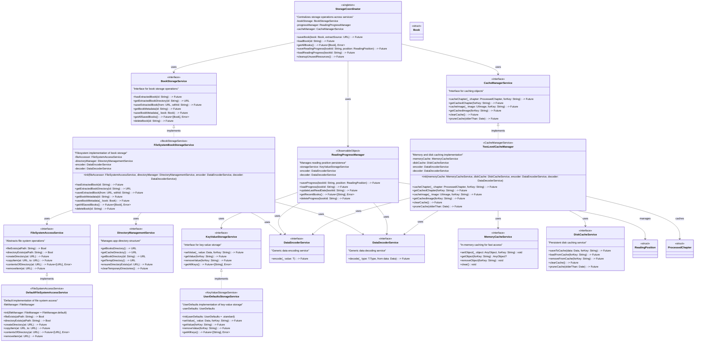

```mermaid
classDiagram
    %% Storage Services Layer - Improved Design
    
    class StorageCoordinator {
        "Centralizes storage operations across services"
        <<singleton>>
        -bookStorage: BookStorageService
        -progressManager: ReadingProgressManager
        -cacheManager: CacheManagerService
        +saveBook(book: Book, extractSource: URL) -> Future<Void, Error>
        +loadBook(id: String) -> Future<Book?, Error>
        +getAllBooks() -> Future<[Book], Error>
        +saveReadingProgress(bookId: String, position: ReadingPosition) -> Future<Void, Error>
        +loadReadingProgress(bookId: String) -> Future<ReadingPosition?, Error>
        +cleanupUnusedResources() -> Future<Void, Error>
    }
    
    class BookStorageService {
        "Interface for book storage operations"
        <<interface>>
        +hasExtractedBook(id: String) -> Future<Bool, Error>
        +getExtractedBookDirectory(id: String) -> URL
        +saveExtractedBook(from: URL, withId: String) -> Future<Void, Error>
        +getBookMetadata(id: String) -> Future<Book?, Error>
        +saveBookMetadata(_ book: Book) -> Future<Void, Error>
        +getAllSavedBooks() -> Future<[Book], Error>
        +deleteBook(id: String) -> Future<Void, Error>
    }

    class FileSystemBookStorageService {
        "Filesystem implementation of book storage"
        <<BookStorageService>>
        -fileAccessor: FileSystemAccessService
        -directoryManager: DirectoryManagementService
        -encoder: DataEncoderService
        -decoder: DataDecoderService
        +init(fileAccessor: FileSystemAccessService, directoryManager: DirectoryManagementService, encoder: DataEncoderService, decoder: DataDecoderService)
        +hasExtractedBook(id: String) -> Future<Bool, Error>
        +getExtractedBookDirectory(id: String) -> URL
        +saveExtractedBook(from: URL, withId: String) -> Future<Void, Error>
        +getBookMetadata(id: String) -> Future<Book?, Error>
        +saveBookMetadata(_ book: Book) -> Future<Void, Error>
        +getAllSavedBooks() -> Future<[Book], Error>
        +deleteBook(id: String) -> Future<Void, Error>
    }
    
    class FileSystemAccessService {
        "Abstracts file system operations"
        <<interface>>
        +fileExists(atPath: String) -> Bool
        +directoryExists(atPath: String) -> Bool
        +createDirectory(at: URL) -> Future<Void, Error>
        +copyItem(at: URL, to: URL) -> Future<Void, Error>
        +contentsOfDirectory(at: URL) -> Future<[URL], Error>
        +removeItem(at: URL) -> Future<Void, Error>
    }
    
    class DefaultFileSystemAccessService {
        "Default implementation of file system access"
        <<FileSystemAccessService>>
        -fileManager: FileManager
        +init(fileManager: FileManager = FileManager.default)
        +fileExists(atPath: String) -> Bool
        +directoryExists(atPath: String) -> Bool
        +createDirectory(at: URL) -> Future<Void, Error>
        +copyItem(at: URL, to: URL) -> Future<Void, Error>
        +contentsOfDirectory(at: URL) -> Future<[URL], Error>
        +removeItem(at: URL) -> Future<Void, Error>
    }
    
    class DirectoryManagementService {
        "Manages app directory structure"
        <<interface>>
        +getBooksDirectory() -> URL
        +getCacheDirectory() -> URL
        +getBookDirectory(id: String) -> URL
        +getTempDirectory() -> URL
        +ensureDirectoryExists(url: URL) -> Future<Void, Error>
        +clearTemporaryDirectories() -> Future<Void, Error>
    }
    
    class ReadingProgressManager {
        "Manages reading position persistence"
        <<ObservableObject>>
        -storageService: KeyValueStorageService
        -encoder: DataEncoderService
        -decoder: DataDecoderService
        +saveProgress(bookId: String, position: ReadingPosition) -> Future<Void, Error>
        +loadProgress(bookId: String) -> Future<ReadingPosition?, Error>
        +updateLastReadDate(bookId: String) -> Future<Void, Error>
        +getRecentBooks() -> Future<[String], Error>
        +deleteProgress(bookId: String) -> Future<Void, Error>
    }
    
    class KeyValueStorageService {
        "Interface for key-value storage"
        <<interface>>
        +setValue(_ value: Data, forKey: String) -> Future<Void, Error>
        +getValue(forKey: String) -> Future<Data?, Error>
        +removeValue(forKey: String) -> Future<Void, Error>
        +getAllKeys() -> Future<[String], Error>
    }
    
    class UserDefaultsStorageService {
        "UserDefaults implementation of key-value storage"
        <<KeyValueStorageService>>
        -userDefaults: UserDefaults
        +init(userDefaults: UserDefaults = .standard)
        +setValue(_ value: Data, forKey: String) -> Future<Void, Error>
        +getValue(forKey: String) -> Future<Data?, Error>
        +removeValue(forKey: String) -> Future<Void, Error>
        +getAllKeys() -> Future<[String], Error>
    }
    
    class DataEncoderService {
        "Generic data encoding service"
        <<interface>>
        +encode<T: Encodable>(_ value: T) -> Future<Data, Error>
    }
    
    class DataDecoderService {
        "Generic data decoding service"
        <<interface>>
        +decode<T: Decodable>(_ type: T.Type, from data: Data) -> Future<T, Error>
    }
    
    class CacheManagerService {
        "Interface for caching objects"
        <<interface>>
        +cacheChapter(_ chapter: ProcessedChapter, forKey: String) -> Future<Void, Error>
        +getCachedChapter(forKey: String) -> Future<ProcessedChapter?, Error>
        +cacheImage(_ image: UIImage, forKey: String) -> Future<Void, Error>
        +getCachedImage(forKey: String) -> Future<UIImage?, Error>
        +clearCache() -> Future<Void, Error>
        +pruneCache(olderThan: Date) -> Future<Void, Error>
    }
    
    class TwoLevelCacheManager {
        "Memory and disk caching implementation"
        <<CacheManagerService>>
        -memoryCache: MemoryCacheService
        -diskCache: DiskCacheService
        -encoder: DataEncoderService
        -decoder: DataDecoderService
        +init(memoryCache: MemoryCacheService, diskCache: DiskCacheService, encoder: DataEncoderService, decoder: DataDecoderService)
        +cacheChapter(_ chapter: ProcessedChapter, forKey: String) -> Future<Void, Error>
        +getCachedChapter(forKey: String) -> Future<ProcessedChapter?, Error>
        +cacheImage(_ image: UIImage, forKey: String) -> Future<Void, Error>
        +getCachedImage(forKey: String) -> Future<UIImage?, Error>
        +clearCache() -> Future<Void, Error>
        +pruneCache(olderThan: Date) -> Future<Void, Error>
    }
    
    class MemoryCacheService {
        "In-memory caching for fast access"
        <<interface>>
        +setObject(_ object: AnyObject, forKey: String) void
        +getObject(forKey: String) AnyObject?
        +removeObject(forKey: String) void
        +clear() void
    }
    
    class DiskCacheService {
        "Persistent disk caching service"
        <<interface>>
        +saveToCache(data: Data, forKey: String) -> Future<Void, Error>
        +loadFromCache(forKey: String) -> Future<Data?, Error>
        +removeFromCache(forKey: String) -> Future<Void, Error>
        +clearCache() -> Future<Void, Error>
        +pruneCache(olderThan: Date) -> Future<Void, Error>
    }
    
    class ReadingPosition { <<struct>> } 
    class Book { <<struct>> } 
    class ProcessedChapter { <<struct>> }

    %% Relationships
    BookStorageService <|.. FileSystemBookStorageService : implements
    FileSystemAccessService <|.. DefaultFileSystemAccessService : implements
    KeyValueStorageService <|.. UserDefaultsStorageService : implements
    CacheManagerService <|.. TwoLevelCacheManager : implements
    
    StorageCoordinator --> BookStorageService : uses
    StorageCoordinator --> ReadingProgressManager : uses
    StorageCoordinator --> CacheManagerService : uses
    
    FileSystemBookStorageService --> FileSystemAccessService : uses
    FileSystemBookStorageService --> DirectoryManagementService : uses
    FileSystemBookStorageService --> DataEncoderService : uses
    FileSystemBookStorageService --> DataDecoderService : uses
    
    ReadingProgressManager --> KeyValueStorageService : uses
    ReadingProgressManager --> DataEncoderService : uses
    ReadingProgressManager --> DataDecoderService : uses
    ReadingProgressManager --> ReadingPosition : manages
    
    TwoLevelCacheManager --> MemoryCacheService : uses
    TwoLevelCacheManager --> DiskCacheService : uses
    TwoLevelCacheManager --> DataEncoderService : uses
    TwoLevelCacheManager --> DataDecoderService : uses
    TwoLevelCacheManager --> ProcessedChapter : caches
``` 