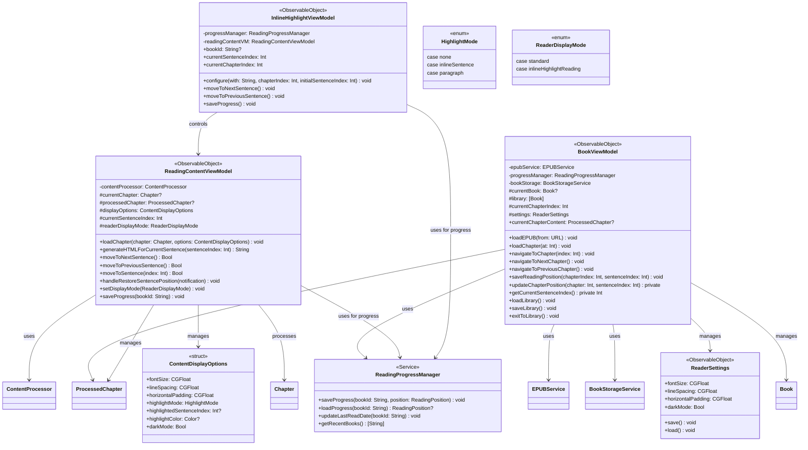

```mermaid
classDiagram
    %% ViewModels Layer
    class BookViewModel {
        <<ObservableObject>>
        -epubService: EPUBService
        -progressManager: ReadingProgressManager
        -bookStorage: BookStorageService
        #currentBook: Book?
        #library: [Book]
        #currentChapterIndex: Int
        #settings: ReaderSettings
        +currentChapterContent: ProcessedChapter?
        +loadEPUB(from: URL) void
        +loadChapter(at: Int) void
        +navigateToChapter(index: Int) void
        +navigateToNextChapter() void
        +navigateToPreviousChapter() void
        +saveReadingPosition(chapterIndex: Int, sentenceIndex: Int) void
        +updateChapterPosition(chapter: Int, sentenceIndex: Int) private
        +getCurrentSentenceIndex() private Int
        +loadLibrary() void
        +saveLibrary() void
        +exitToLibrary() void
    }

    class ReadingContentViewModel {
        <<ObservableObject>>
        -contentProcessor: ContentProcessor
        #currentChapter: Chapter?
        #processedChapter: ProcessedChapter?
        #displayOptions: ContentDisplayOptions
        #currentSentenceIndex: Int
        #readerDisplayMode: ReaderDisplayMode
        +loadChapter(chapter: Chapter, options: ContentDisplayOptions) void
        +generateHTMLForCurrentSentence(sentenceIndex: Int) String
        +moveToNextSentence() Bool
        +moveToPreviousSentence() Bool
        +moveToSentence(index: Int) Bool
        +handleRestoreSentencePosition(notification) void
        +setDisplayMode(ReaderDisplayMode) void
        +saveProgress(bookId: String) void
    }
    
    class InlineHighlightViewModel {
        <<ObservableObject>>
        -progressManager: ReadingProgressManager
        -readingContentVM: ReadingContentViewModel
        +bookId: String?
        +currentSentenceIndex: Int
        +currentChapterIndex: Int
        +configure(with: String, chapterIndex: Int, initialSentenceIndex: Int) void
        +moveToNextSentence() void
        +moveToPreviousSentence() void
        +saveProgress() void
    }
    
    class ContentDisplayOptions {
        <<struct>>
        +fontSize: CGFloat
        +lineSpacing: CGFloat
        +horizontalPadding: CGFloat
        +highlightMode: HighlightMode
        +highlightedSentenceIndex: Int?
        +highlightColor: Color?
        +darkMode: Bool
    }
    
    class HighlightMode {
        <<enum>>
        case none
        case inlineSentence
        case paragraph
    }
    
    class ReaderDisplayMode {
        <<enum>>
        case standard
        case inlineHighlightReading
    }
    
    class ReadingProgressManager {
        <<Service>>
        +saveProgress(bookId: String, position: ReadingPosition) void
        +loadProgress(bookId: String) ReadingPosition?
        +updateLastReadDate(bookId: String) void
        +getRecentBooks() [String]
    }
    
    class ReaderSettings {
        <<ObservableObject>>
        +fontSize: CGFloat
        +lineSpacing: CGFloat
        +horizontalPadding: CGFloat
        +darkMode: Bool
        +save() void
        +load() void
    }

    BookViewModel --> EPUBService : uses
    BookViewModel --> ReadingProgressManager : uses
    BookViewModel --> BookStorageService : uses
    BookViewModel --> ReaderSettings : manages
    BookViewModel --> Book : manages
    BookViewModel --> ProcessedChapter : provides
    
    ReadingContentViewModel --> ContentProcessor : uses
    ReadingContentViewModel --> ProcessedChapter : manages
    ReadingContentViewModel --> ContentDisplayOptions : manages
    ReadingContentViewModel --> Chapter : processes
    ReadingContentViewModel --> ReadingProgressManager : uses for progress
    
    InlineHighlightViewModel --> ReadingContentViewModel : controls
    InlineHighlightViewModel --> ReadingProgressManager : uses for progress
``` 