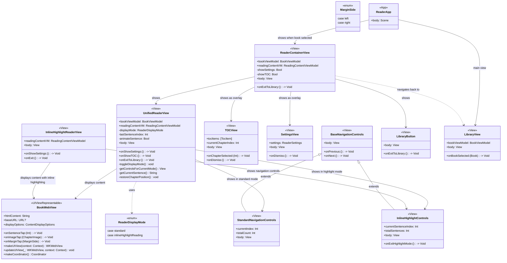

```mermaid
classDiagram
    %% Views Layer
    class ReaderContainerView {
        <<View>>
        +bookViewModel: BookViewModel
        +readingContentVM: ReadingContentViewModel
        -showSettings: Bool
        -showTOC: Bool
        +onExitToLibrary: () -> Void
        +body: View
    }

    class UnifiedReaderView {
        <<View>>
        +bookViewModel: BookViewModel
        +readingContentVM: ReadingContentViewModel
        -displayMode: ReaderDisplayMode
        -lastSentenceIndex: Int
        -animateSentence: Bool
        +onShowSettings: () -> Void
        +onShowTOC: () -> Void
        +onExitToLibrary: () -> Void
        +body: View
        -toggleDisplayMode() void
        -getControlsForCurrentMode() View
        -getCurrentSentence() String
        -restoreChapterPosition() void
    }

    class ReaderDisplayMode {
        <<enum>>
        case standard
        case inlineHighlightReading
    }

    class BookWebView {
        <<UIViewRepresentable>>
        +htmlContent: String
        +baseURL: URL?
        +displayOptions: ContentDisplayOptions
        +onSentenceTap: (Int) -> Void
        +onImageTap: (ChapterImage) -> Void
        +onMarginTap: (MarginSide) -> Void
        +makeUIView(context: Context) WKWebView
        +updateUIView(_: WKWebView, context: Context) void
        +makeCoordinator() Coordinator
    }
    
    class InlineHighlightReaderView {
        <<View>>
        +readingContentVM: ReadingContentViewModel
        +onShowSettings: () -> Void
        +onExit: () -> Void
        +body: View
    }
    
    class TOCView {
        <<View>>
        +tocItems: [TocItem]
        +currentChapterIndex: Int
        +onChapterSelected: (Int) -> Void
        +onDismiss: () -> Void
        +body: View
    }
    
    class SettingsView {
        <<View>>
        +settings: ReaderSettings
        +onDismiss: () -> Void
        +body: View
    }

    class BaseNavigationControls {
        <<View>>
        +onPrevious: () -> Void
        +onNext: () -> Void
        +body: View
    }

    class StandardNavigationControls {
        <<View>>
        +currentIndex: Int
        +totalCount: Int
        +body: View
    }

    class InlineHighlightControls {
        <<View>>
        +currentSentenceIndex: Int
        +totalSentences: Int
        +onExitHighlightMode: () -> Void
        +body: View
    }

    class LibraryButton {
        <<View>>
        +onExitToLibrary: () -> Void
        +body: View
    }

    class MarginSide {
        <<enum>>
        case left
        case right
    }

    class LibraryView {
        <<View>>
        +bookViewModel: BookViewModel
        +onBookSelected: (Book) -> Void
        +body: View
    }

    class ReaderApp {
        <<App>>
        +body: Scene
    }

    ReaderContainerView --> UnifiedReaderView : shows
    ReaderContainerView --> TOCView : shows as overlay
    ReaderContainerView --> SettingsView : shows as overlay
    ReaderContainerView --> LibraryButton : shows
    UnifiedReaderView --> BookWebView : displays content
    UnifiedReaderView --> StandardNavigationControls : shows in standard mode
    UnifiedReaderView --> InlineHighlightControls : shows in highlight mode
    UnifiedReaderView ..> ReaderDisplayMode : uses
    InlineHighlightReaderView --> BookWebView : displays content with inline highlighting
    InlineHighlightReaderView --> InlineHighlightControls : shows navigation controls
    ReaderApp --> LibraryView : main view
    ReaderApp --> ReaderContainerView : shows when book selected
    ReaderContainerView ..> LibraryView : navigates back to
    
    BaseNavigationControls <|-- StandardNavigationControls : extends
    BaseNavigationControls <|-- InlineHighlightControls : extends
``` 