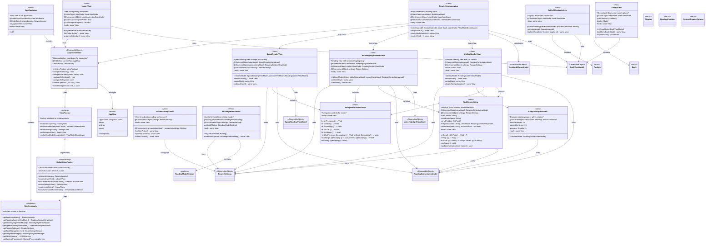

```mermaid
classDiagram
    %% Views Layer - Improved Component Design
    
    %% Top-level coordinator
    class AppCoordinator {
        "Main application coordinator for navigation"
        <<ObservableObject>>
        @Published currentFlow: AppFlow
        -viewFactory: ViewFactory
        +init(viewFactory: ViewFactory)
        +navigateToLibrary() void
        +navigateToReader(book: Book) void
        +navigateToSettings() void
        +navigateToImport() void
        +handleOpenURL(url: URL) void
        +handleDeepLink(url: URL) void
    }
    
    class AppFlow {
        "Application navigation state"
        <<enum>>
        library
        reader(Book)
        settings
        import
    }
    
    %% View Factory for dependency injection
    class ViewFactory {
        "Factory interface for creating views"
        <<protocol>>
        +makeLibraryView() LibraryView
        +makeReaderView(book: Book) ReaderContainerView
        +makeSettingsView() SettingsView
        +makeImportView() ImportView
        +makeViewModelCoordinator() ViewModelCoordinator
    }
    
    class DefaultViewFactory {
        "Default implementation of view factory"
        <<ViewFactory>>
        -serviceLocator: ServiceLocator
        +init(serviceLocator: ServiceLocator)
        +makeLibraryView() LibraryView
        +makeReaderView(book: Book) ReaderContainerView
        +makeSettingsView() SettingsView
        +makeImportView() ImportView
        +makeViewModelCoordinator() ViewModelCoordinator
    }
    
    class ServiceLocator {
        "Provides access to services"
        <<singleton>>
        +getBookViewModel() BookViewModel
        +getReadingContentViewModel() ReadingContentViewModel
        +getInlineHighlightViewModel() InlineHighlightViewModel
        +getSpeedReadingViewModel() SpeedReadingViewModel
        +getReaderSettings() ReaderSettings
        +getBookStorageService() BookStorageService
        +getProgressManager() ReadingProgressManager
        +getEPUBService() EPUBService
        +getContentProcessor() ContentProcessingService
    }
    
    %% Main View Container
    class AppRootView {
        "Root view of the application"
        <<View>>
        @StateObject coordinator: AppCoordinator
        @StateObject serviceLocator: ServiceLocator
        -navigationView: some View
        +init()
        +body: some View
    }
    
    %% View Modules
    class LibraryView {
        "Shows book library and import options"
        <<View>>
        @StateObject viewModel: BookViewModel
        -gridColumns: [GridItem]
        -books: [Book]
        +init(viewModel: BookViewModel)
        +body: some View
        -bookItem(book: Book) some View
        -importButton() some View
    }
    
    class ReaderContainerView {
        "Main container for reading views"
        <<View>>
        @StateObject viewModel: BookViewModel
        @EnvironmentObject coordinator: AppCoordinator
        @StateObject viewModelCoordinator: ViewModelCoordinator
        +init(viewModel: BookViewModel, book: Book, coordinator: ViewModelCoordinator)
        +body: some View
        -navigationBar() some View
        -readerModeSelector() some View
        -readerView() -> some View
    }
    
    class UnifiedReaderView {
        "Standard reading view with full content"
        <<View>>
        @ObservedObject viewModel: ReadingContentViewModel
        @EnvironmentObject settings: ReaderSettings
        -showControls: Bool
        +init(viewModel: ReadingContentViewModel)
        +body: some View
        -contentView() some View
        -controlBar() some View
        -chapterNavigationView() some View
    }
    
    class InlineHighlightReaderView {
        "Reading view with sentence highlighting"
        <<View>>
        @ObservedObject viewModel: InlineHighlightViewModel
        @ObservedObject contentViewModel: ReadingContentViewModel
        @EnvironmentObject settings: ReaderSettings
        +init(viewModel: InlineHighlightViewModel, contentViewModel: ReadingContentViewModel)
        +body: some View
        -contentView() some View
        -controlBar() some View
    }
    
    class SpeedReaderView {
        "Speed reading view for rapid text display"
        <<View>>
        @ObservedObject viewModel: SpeedReadingViewModel
        @ObservedObject contentViewModel: ReadingContentViewModel
        @EnvironmentObject settings: ReaderSettings
        +init(viewModel: SpeedReadingViewModel, contentViewModel: ReadingContentViewModel)
        +body: some View
        -contentDisplay() some View
        -controlBar() some View
        -settingsPanel() some View
    }
    
    class WebContentView {
        "Displays HTML content with interactions"
        <<View>>
        @ObservedObject viewModel: ReadingContentViewModel
        @EnvironmentObject settings: ReaderSettings
        -htmlContent: String
        -coordinateSpace: String
        -scrollPosition: CGPoint?
        -onScroll: ((CGPoint) -> Void)?
        -onTap: (() -> Void)?
        +init(htmlContent: String, viewModel: ReadingContentViewModel, 
              coordinateSpace: String, scrollPosition: CGPoint?, 
              onScroll: ((CGPoint) -> Void)?, onTap: (() -> Void)?)
        +body: some View
        +onAppear() void
        +updateUIView(context: Context) void
    }
    
    class TableOfContentsView {
        "Displays book table of contents"
        <<View>>
        @ObservedObject viewModel: BookViewModel
        @Environment(\.presentationMode) presentationMode: Binding<PresentationMode>
        +init(viewModel: BookViewModel)
        +body: some View
        -tocItemView(item: TocItem, depth: Int) some View
    }
    
    class ReaderSettingsView {
        "View for adjusting reading preferences"
        <<View>>
        @EnvironmentObject settings: ReaderSettings
        @Environment(\.presentationMode) presentationMode: Binding<PresentationMode>
        +body: some View
        -fontSizePicker() some View
        -spacingControls() some View
        -themeControls() some View
    }
    
    class ImportView {
        "View for importing new books"
        <<View>>
        @StateObject viewModel: BookViewModel
        @EnvironmentObject coordinator: AppCoordinator
        @State isShowingFilePicker: Bool
        @State importProgress: Double?
        +init(viewModel: BookViewModel)
        +body: some View
        -filePickerButton() some View
        -progressIndicator() some View
    }
    
    class ReadingModeControl {
        "Control for switching reading modes"
        <<View>>
        @Binding selectedMode: ReadingModeStrategy
        @EnvironmentObject settings: ReaderSettings
        -availableModes: [ReadingModeStrategy]
        +init(selectedMode: Binding<ReadingModeStrategy>)
        +body: some View
        -modeButton(mode: ReadingModeStrategy) some View
    }
    
    class NavigationControlsView {
        "Navigation controls for reader"
        <<View>>
        let onPrevious: () -> Void
        let onNext: () -> Void
        let onSettings: () -> Void
        let onTOC: () -> Void
        let onLibrary: () -> Void
        +init(onPrevious: @escaping () -> Void, onNext: @escaping () -> Void, 
              onSettings: @escaping () -> Void, onTOC: @escaping () -> Void,
              onLibrary: @escaping () -> Void)
        +body: some View
    }
    
    class ChapterProgressView {
        "Displays reading progress within chapter"
        <<View>>
        @ObservedObject viewModel: ReadingContentViewModel
        -totalSentences: Int
        -currentSentence: Int
        -progress: Double <<computed>>
        +init(viewModel: ReadingContentViewModel)
        +body: some View
    }
    
    %% Models referenced in Views
    class Book { <<struct>> }
    class Chapter { <<struct>> }
    class ReadingPosition { <<struct>> }
    class ReadingModeStrategy { <<protocol>> }
    class TocItem { <<struct>> }
    class ContentDisplayOptions { <<struct>> }
    
    %% ViewModels referenced in Views
    class BookViewModel { <<ObservableObject>> }
    class ReadingContentViewModel { <<ObservableObject>> }
    class InlineHighlightViewModel { <<ObservableObject>> }
    class SpeedReadingViewModel { <<ObservableObject>> }
    class ViewModelCoordinator { <<ObservableObject>> }
    
    class ReaderSettings { <<ObservableObject>> }
    
    %% View Relationships
    AppCoordinator --> AppFlow : manages
    AppCoordinator --> ViewFactory : uses
    
    ViewFactory <|.. DefaultViewFactory : implements
    DefaultViewFactory --> ServiceLocator : uses
    
    AppRootView --> AppCoordinator : contains
    AppRootView --> ServiceLocator : contains
    
    LibraryView --> BookViewModel : uses
    LibraryView --> Book : displays
    
    ReaderContainerView --> BookViewModel : uses
    ReaderContainerView --> ViewModelCoordinator : coordinates
    ReaderContainerView --> UnifiedReaderView : may show
    ReaderContainerView --> InlineHighlightReaderView : may show
    ReaderContainerView --> SpeedReaderView : may show
    ReaderContainerView --> AppCoordinator : uses
    
    UnifiedReaderView --> ReadingContentViewModel : uses
    UnifiedReaderView --> WebContentView : contains
    UnifiedReaderView --> NavigationControlsView : contains
    UnifiedReaderView --> ChapterProgressView : contains
    UnifiedReaderView --> ReaderSettings : uses
    
    InlineHighlightReaderView --> InlineHighlightViewModel : uses
    InlineHighlightReaderView --> ReadingContentViewModel : uses
    InlineHighlightReaderView --> WebContentView : contains
    InlineHighlightReaderView --> NavigationControlsView : contains
    InlineHighlightReaderView --> ReaderSettings : uses
    
    SpeedReaderView --> SpeedReadingViewModel : uses
    SpeedReaderView --> ReadingContentViewModel : uses
    SpeedReaderView --> NavigationControlsView : contains
    SpeedReaderView --> ReaderSettings : uses
    
    WebContentView --> ReadingContentViewModel : uses
    WebContentView --> ReaderSettings : uses
    
    TableOfContentsView --> BookViewModel : uses
    TableOfContentsView --> TocItem : displays
    
    ReaderSettingsView --> ReaderSettings : configures
    
    ImportView --> BookViewModel : uses
    ImportView --> AppCoordinator : uses
    
    ReadingModeControl --> ReadingModeStrategy : manages
    ReadingModeControl --> ReaderSettings : uses
    
    ChapterProgressView --> ReadingContentViewModel : uses
``` 