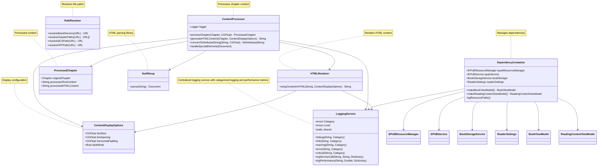

```mermaid
classDiagram
    direction TB

    %% Core Services
    class ContentProcessor {
        -Logger logger
        +processChapter(Chapter, CGFloat) ProcessedChapter
        +generateHTMLContent(Chapter, ContentDisplayOptions) String
        +convertToAttributedString(String, CGFloat) NSAttributedString
        -handleSpecialElements(Document)
    }

    class DependencyContainer {
        +EPUBResourceManager epubResourceManager
        +EPUBService epubService
        +BookStorageService bookStorage
        +ReaderSettings readerSettings
        +makeBookViewModel() BookViewModel
        +makeReadingContentViewModel() ReadingContentViewModel
        -logResourcePaths()
    }

    class HTMLRenderer {
        +wrapContentInHTML(String, ContentDisplayOptions) String
    }

    class PathResolver {
        +resolveBaseDirectory(URL) URL
        +resolveChapterPaths(URL) URL[]
        +resolveNCXPath(URL) URL
        +resolveOPFPath(URL) URL
    }

    %% Supporting Types
    class ContentDisplayOptions {
        +CGFloat fontSize
        +CGFloat lineSpacing
        +CGFloat horizontalPadding
        +Bool darkMode
    }

    class ProcessedChapter {
        +Chapter originalChapter
        +String processedTextContent
        +String processedHTMLContent
    }

    %% External Dependencies
    class SwiftSoup {
        +parse(String) Document
    }

    class LoggingService {
        +enum Category
        +enum Level
        +static shared
        +debug(String, Category)
        +info(String, Category)
        +warning(String, Category)
        +error(String, Category)
        +critical(String, Category)
        +logServiceCall(String, String, Dictionary)
        +logPerformance(String, Double, Dictionary)
    }

    %% Relationships
    ContentProcessor --> HTMLRenderer
    ContentProcessor --> SwiftSoup
    ContentProcessor --> LoggingService
    ContentProcessor --> ProcessedChapter
    ContentProcessor --> ContentDisplayOptions

    DependencyContainer --> EPUBResourceManager
    DependencyContainer --> EPUBService
    DependencyContainer --> BookStorageService
    DependencyContainer --> ReaderSettings
    DependencyContainer --> BookViewModel
    DependencyContainer --> ReadingContentViewModel
    DependencyContainer --> LoggingService

    HTMLRenderer --> ContentDisplayOptions
    HTMLRenderer --> LoggingService

    %% Notes
    note for ContentProcessor "Processes chapter content"
    note for DependencyContainer "Manages dependencies"
    note for HTMLRenderer "Renders HTML content"
    note for PathResolver "Resolves file paths"
    note for ContentDisplayOptions "Display configuration"
    note for ProcessedChapter "Processed content"
    note for SwiftSoup "HTML parsing library"
    note for LoggingService "Centralized logging service with categorized logging and performance metrics"
``` 